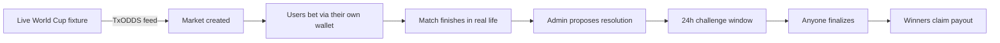
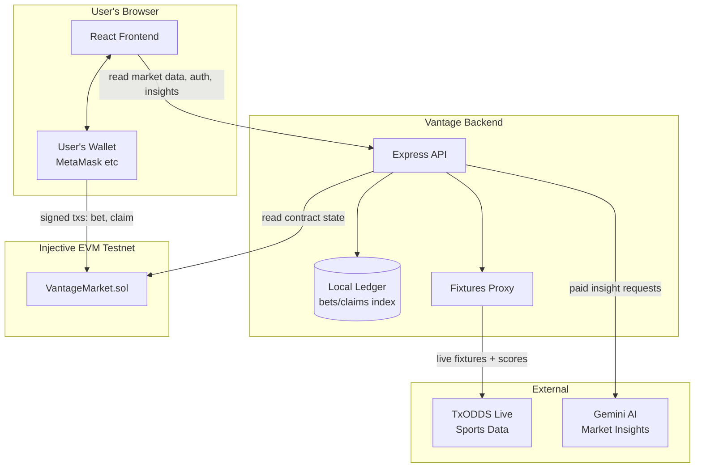
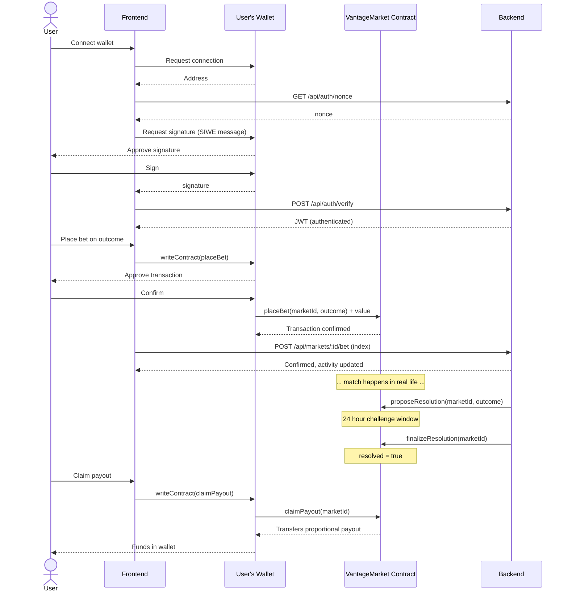
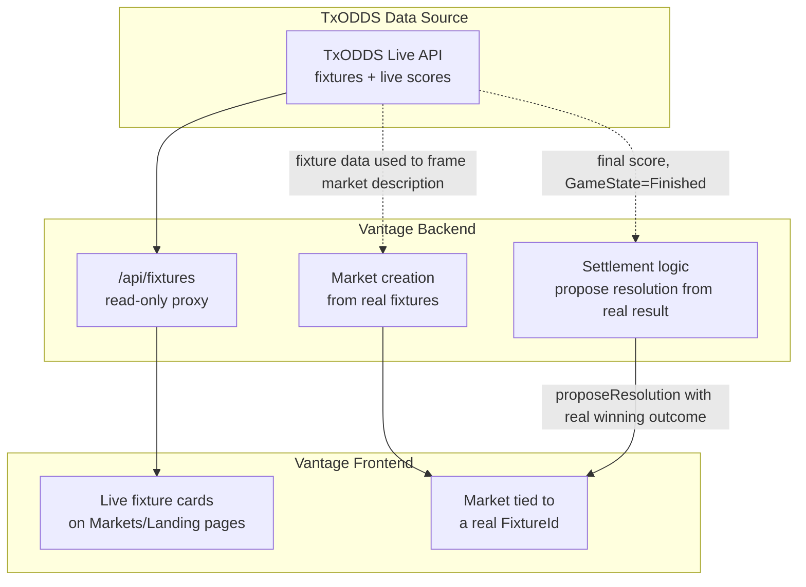

# Vantage

An AI-native, non-custodial sports prediction market built on Injective, using live World Cup 2026 data to power real markets that settle against real match results.

Vantage lets users bet on binary match outcomes ("Will England beat Argentina?"), with pools that pay out proportionally to winners once a market resolves. Markets are tied to real fixtures pulled from a live sports-data feed, and resolution follows a propose-then-finalize pattern with a built-in delay window rather than instant, unchallengeable admin control.

---

## Table of contents

- [How it works, end to end](#how-it-works-end-to-end)
- [Architecture](#architecture)
- [The betting lifecycle](#the-betting-lifecycle)
- [TxODDS / World Cup data integration](#txodds--world-cup-data-integration)
- [Injective technology integrations](#injective-technology-integrations)
- [Known limitations](#known-limitations)
- [Running it locally](#running-it-locally)
- [Project structure](#project-structure)

---

## How it works, end to end

1. A market is created, either manually by an admin or linked to a real live fixture pulled from TxODDS (e.g. "Will England beat Argentina?", tied to the actual England vs Argentina World Cup match).
2. Users connect a wallet (any injected EVM wallet - MetaMask, etc.), sign in with Sign-In-With-Ethereum (SIWE) to authenticate, and place bets directly from their own wallet. Bets are real on-chain transactions the user signs themselves - Vantage never holds user funds in a custodial pool.
3. Once the real match finishes, an admin (or, in principle, an automated oracle process) proposes a resolution based on the actual result.
4. A 24-hour challenge window opens. This is a deliberate delay, not an instant admin override - it exists so a proposed resolution isn't immediately final.
5. After the window passes, anyone (not just the admin) can call finalize, which locks in the outcome on-chain.
6. Users who bet on the winning outcome claim their proportional share of the losing pool, directly from the contract, to their own wallet.



---

## Architecture

Vantage has three main parts: a Solidity smart contract on Injective, a backend API that indexes chain state and proxies live sports data, and a React frontend where users actually connect wallets and bet.



Key architectural decision: **betting is wallet-direct, not custodial.** The frontend calls the contract's `placeBet` and `claimPayout` functions directly through the user's own connected wallet. The backend never holds user funds or signs bets on a user's behalf - its job is to serve market data, proxy live sports data, index activity for the UI, and gate premium content, not to move money.

---

## The betting lifecycle



---

## TxODDS / World Cup data integration

Vantage uses TxODDS's live sports data feed to ground its prediction markets in real fixtures and real results, rather than synthetic or manually-entered match data.



**What's live and demoed:** the read-only fixture and live-score proxy (`GET /api/fixtures`, `GET /api/fixtures/:id/scores`), which pulls real, current World Cup 2026 match data and displays it in the app. Markets are created with real fixture IDs attached (`fixtureId`, `category`, `stage`, team labels), so every market in Vantage is traceable back to an actual match.

**What exists but runs manually, deliberately, not automated during demos:** an oracle settlement loop (`backend/src/oracle/txline.ts`) that can watch fixtures for a `Finished` state and automatically call `proposeResolution` with the real match outcome once real score data is available. This code exists, has been reviewed, and does not fabricate outcomes when score data is missing - it explicitly skips and retries rather than guess. It is kept off by default and resolution is done manually via the admin dashboard for predictability during judging and demos, since it depends on external infra (a Solana devnet subscription flow) that adds a live failure surface we chose not to depend on for the recorded demo.

---

## Injective technology integrations

| Technology | Status | What it demonstrates |
|---|---|---|
| **Smart contract on Injective EVM** | Live, tested | `VantageMarket.sol` deployed on Injective EVM Testnet, with a propose-then-finalize resolution model (24h delay before any resolution becomes final and payouts unlock) rather than instant single-step admin control |
| **x402 (agentic payments)** | Live, tested | `GET /api/premium-stats/:marketId` implements the HTTP 402 pattern - returns payment instructions, verifies a real on-chain payment transaction (recipient, amount, confirmation), then serves an AI-generated market insight. Includes replay protection so a payment can't be reused. |
| **CCTP (cross-chain USDC)** | Configured, not live-demoed | Forked Circle's CCTP MCP server and added Injective EVM Testnet as a supported chain (domain 29, verified against Circle's official documentation), with real USDC and TokenMessenger contract addresses wired in. Live end-to-end transfer execution was blocked by testnet faucet access constraints during the development window rather than a code or configuration issue. |
| **MCP tooling** | Partial | The CCTP fork itself is an MCP server exposing cross-chain transfer tools, extended for Injective. A dedicated MCP server for natural-language bet placement was scoped but not built in the time available. |

---

## Known limitations

Being direct about what's a real limitation versus what's polish, so nothing here is a surprise to a judge or a future contributor:

- **Betting is wallet-direct**, which is the correct, non-custodial design - but the backend's activity ledger is an off-chain index for display purposes, not the source of truth. The contract itself is always the source of truth for balances and outcomes.
- **The propose/finalize resolution model has a time delay, not a dispute mechanism.** During the 24-hour challenge window, there is no on-chain way for anyone to contest a proposed outcome - only time has to pass. This is an anti-instant-finality safeguard, not adversarial verification.
- **The TxODDS-driven automated settlement loop exists but is not run automatically.** It requires manual invocation and depends on infrastructure (a Solana devnet subscription) that was not exercised end-to-end during development.
- **CCTP integration is configured and code-complete but not live-transaction-tested end to end**, due to testnet faucet access issues encountered during development, not a defect in the transfer logic itself.

---

## Running it locally

### Backend

```bash
cd backend
npm install
# create backend/.env with RELAYER_PRIVATE_KEY, ADMIN_KEY, PORT (see backend/.env.example if present)
npm run dev
```

### Frontend

```bash
cd frontend
npm install
npm run dev
```

The frontend proxies `/api/*` to `http://localhost:3001` in development.

### Contracts

```bash
npx hardhat compile
npx hardhat run scripts/deploy.ts --network injectiveTestnet
```

---

## Project structure

```
vantage/
  contracts/
    VantageMarket.sol        Solidity contract: markets, bets, propose/finalize resolution, claims
  backend/
    src/
      contract.ts             Ethers.js connection to the deployed contract
      ledger.ts                Local off-chain index of bets/claims/payments for display
      routes/
        markets.ts             Market CRUD, resolution proposal/finalization
        bets.ts                 Bet/claim indexing, user balance
        premium.ts              x402-gated AI market insights
        fixtures.ts             Read-only TxODDS fixture/score proxy
        auth.ts                 SIWE authentication
      oracle/
        txline.ts               TxODDS subscription + automated settlement loop (manual invocation only)
        marketCreationLoop.ts   Automated market creation from live fixtures (manual invocation only)
  frontend/
    src/
      pages/                    Landing, Markets, Market Detail, Dashboard, Admin
      components/                UI components (betting form, market cards, activity feed, etc.)
      lib/wagmi.ts                Wallet connection config (Injective EVM Testnet)
      contexts/UserContext.tsx    SIWE auth flow
  cctp-mcp/
    src/core/chains.ts          Circle CCTP MCP server, forked and extended with Injective testnet support
```